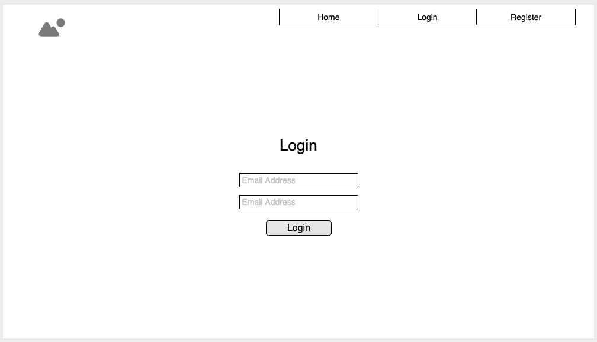
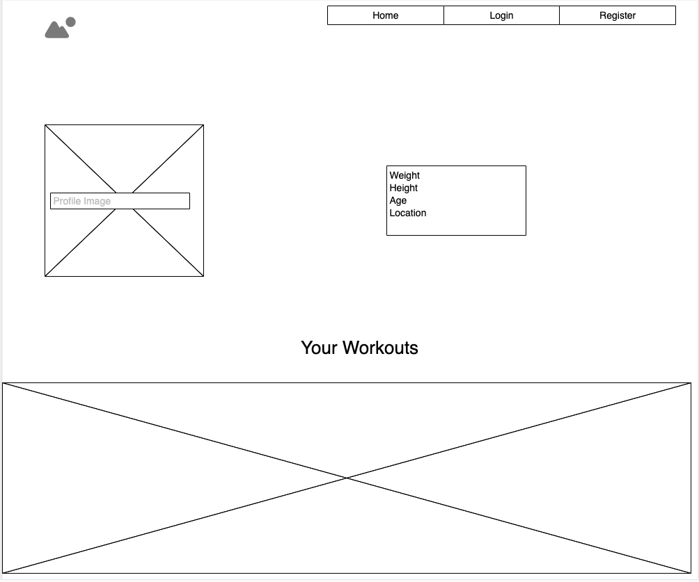

# SixPackApp

SixPackApp is all you need to plan and share workouts with a community of other gym enthusiasts. With a clean UI and features you can quickly customize your own workout or change it up with a host of community generated workouts.

// Wireframe

///////Summary////////
SixPackApp is a CRUD App with simple controllers for accounts and workouts. The workout showpage is publicly available but users must create/login to an account to edit and create custom workouts. It is supposed to function with social platform functionality giving the user the ability to interact with other gym enthusiasts as well as having a custom profile to track their own progress.

//////UI Images//////

///////Technology Used////////
HTML, CSS, JS:
The design and basic front end work was done using these

Express:
Express was the framework used for this CRUD app. Express enabled the integration with the server seamless for the purposes of this app. Using express I was able to install dependencies that made interacting with the mongo database simple yet powerful.

Mongo:
The database used was Mongo. Mongo made accessing data through EJS very simple with its use of keys and value pairs.

socket.io:
Socket IO uses HTTP sockets to handle client-to-server and server-to-client communication in real-time very efficient. SixPackApp uses sockets for all of the social aspects to the app.

bCrypt:
This encoded user passwords for an added level of security.

///////Link to Project//////
